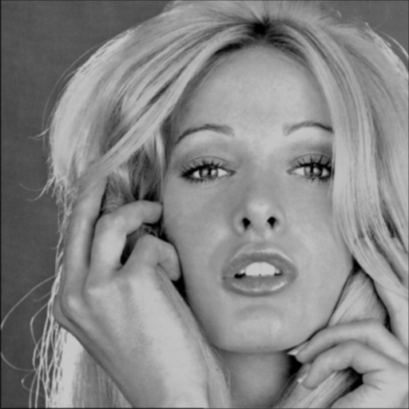
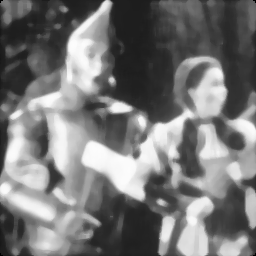
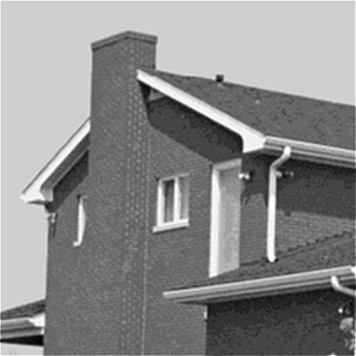
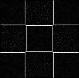
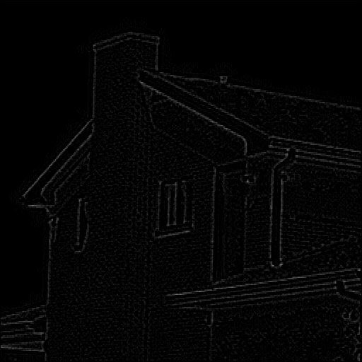
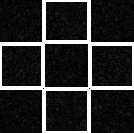
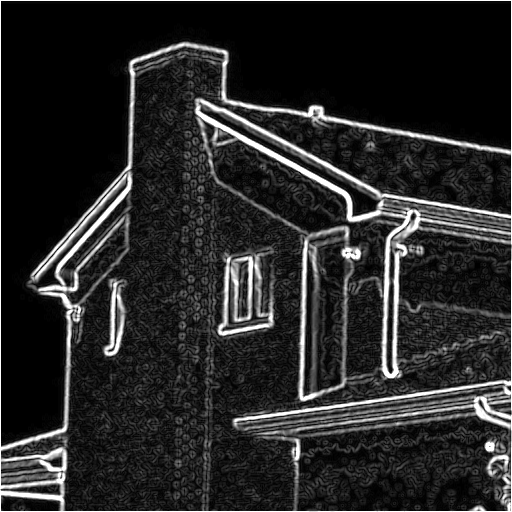
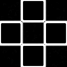
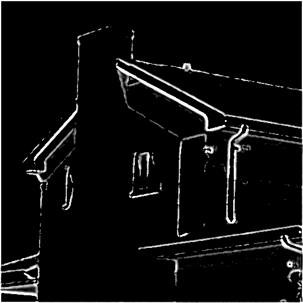

# 第四次作业
*彭相阳 自动化钱61 2160800060*
*2019.03.18*
## 1.空域低通滤波器
高斯滤波器：  
高斯滤波器虽然具有一定的降噪能力，但同时也会模糊化图像的作用也很强  

  
中值滤波器：  
中值滤波器具有很强的降噪能力，也具有一定的模糊图像能力  

## 2.空域高通滤波器
unsharp masking:  
非锐化掩蔽滤波能够很好的增强图像的边缘，突出细节，但是，有可能导致边缘有暗的轮廓。  
    
Laplace edge detection:  
拉普拉斯算子具有很好的边缘检测的能力，而且具有各向同性。  
    
Sobel edge detection:  
sobel算子以较为简单的数学表达式达到提取边缘的效果，而且中心系数使用权重为2很好的突出了中心点的作用，但是它不具有各向同性。  
    
Canny edge detection:  
canny算法借助于双阈值这一思想，去除了为边缘，提取出的边缘更加准确。  
  